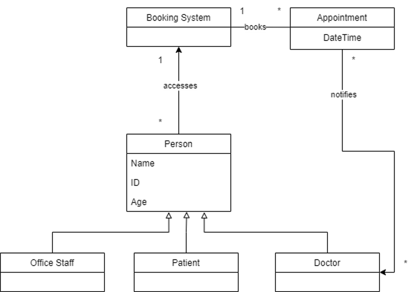
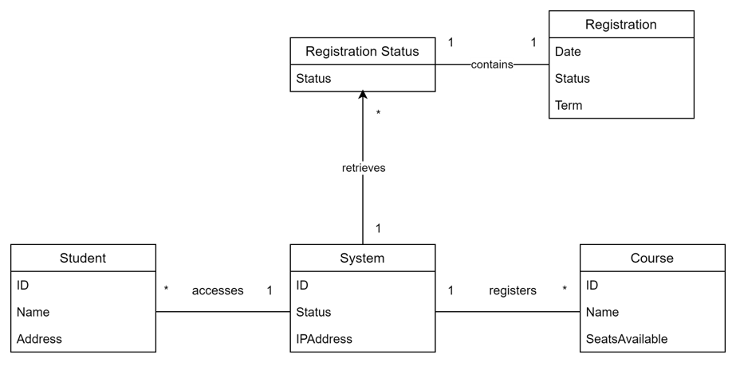

# Unified Modeling Language (UML)

## Exercise 1
CMU Medical Clinic is a general purpose clinic. Patients have to book an appointment to see the doctors. Patients contact Office Staff to book or change an appointment.
- Tasks
  - Identify the classes
  - Create a Class Diagram for Book or Change Appointment
  - Notify doctor about the appointment
 
### Solution

## Exercise 2
CMU Course Registration system enables students to register for courses. Students use this student to enroll in the courses offered by CMU.
- Tasks
  - Identify the classes
  - Create a Class Diagram for course registration
  - Send registration confirmation to student

### Solution

